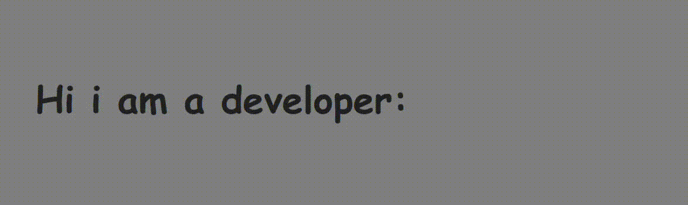

# Dynamic Typewriter Effect



## Overview

The Dynamic Typewriter Effect is a JavaScript script that creates a visually engaging typewriter animation on a webpage. It allows you to display a sequence of words, revealing each letter one by one with random delays, creating a dynamic and attention-grabbing effect.

## Features

- Smooth typewriter animation for an enhanced user experience.
- Customizable array of words to display.
- Randomized delays for a natural and engaging appearance.
- Lightweight and easy to integrate into web projects.

## Usage

1. Include the script in your HTML file:

   ```html
   <script src="js/main.js"></script>
   
2. Ensure your HTML structure includes a container element for the text:

   ```html
   <div class="text">
      <span></span>
   </div>
3. change words:
   ```JavaScript

    var words = ['test1', 'test2', 'test3'];
      


# Customization

    Adjust the words array to include the words you want to display.
    Fine-tune delays by modifying the setTimeout values in the script.

